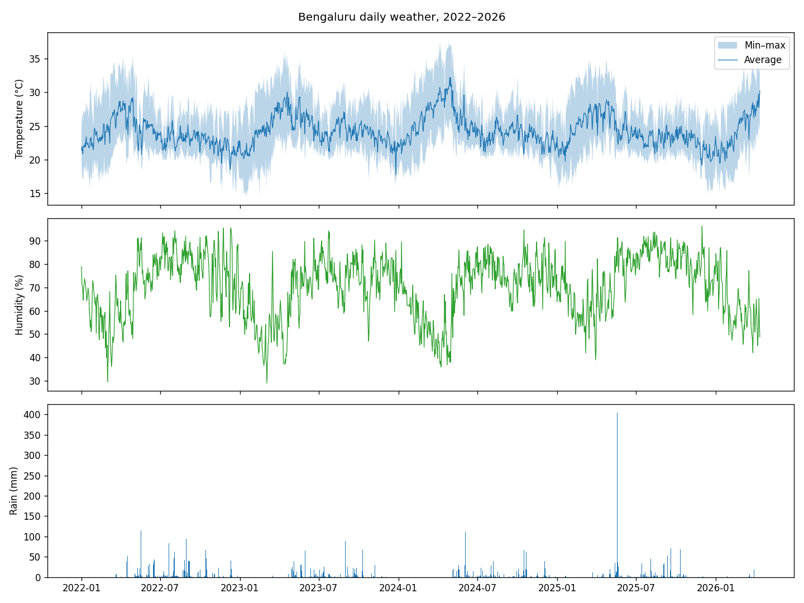
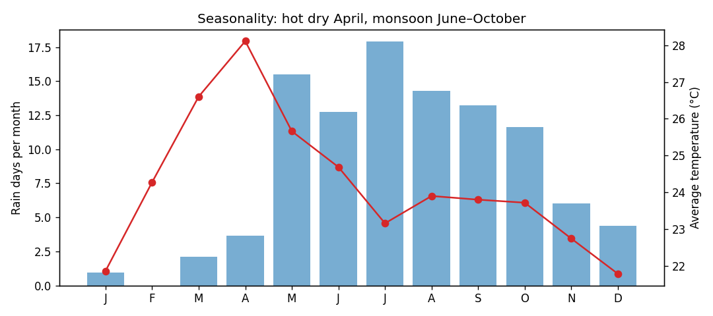
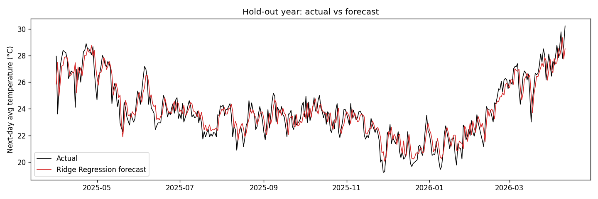

# Bengaluru Weather Forecasting

Forecasts **tomorrow's average temperature** and **whether it will rain tomorrow** in Bengaluru from four years of daily weather-station data, with a strong focus on data quality and honest evaluation against baselines.

## Data

`Bengaluru_Weather.csv` — daily observations, 1 Jan 2022 – 12 Apr 2026 (1,563 days): temperature, dew point, humidity, wind speed and pressure (max / avg / min), plus total precipitation.




## Data quality: the 0 °F problem

The first model had large, sudden errors. Investigating them showed **147 impossible readings**: days with a minimum of exactly **0 °F (−17.8 °C)**, 0 % humidity or 0 inHg pressure — the station's way of logging a failed sensor reading. Those zeros also dragged that day's *average* down (e.g. a 9 °C daily average in January, which never happens in Bengaluru).

Treating these sentinel zeros as missing and interpolating them **cut the forecast error almost in half** (MAE 1.11 °C → 0.66 °C). Genuine zeros — calm wind and dry days — are kept.

## Approach

- **Cleaning** — parse the two-row header, convert °F → °C and inches → mm, fill the one missing calendar day, repair sentinel zeros.
- **Features** (only information available at the end of today): today's weather, temperature lags (1, 2, 3, 7 days), rolling means (3, 7, 30 days), 7-day rain totals and rain-day counts, temperature range, pressure change, and day-of-year encoded with sine/cosine.
- **Chronological split** — train on Jan 2022 – Mar 2025, test on the final 12 months (Apr 2025 – Apr 2026) so every season is tested. No shuffling.
- **Model selection** with `TimeSeriesSplit` cross-validation on the training period — the test year is used only once, for the final report.
- **Baselines** every model must beat: *persistence* (tomorrow = today) and *climatology* (average for that calendar date).

## Results (hold-out year, 376 days)

**Next-day average temperature**

| Model | MAE (°C) | RMSE (°C) | R² |
|---|---|---|---|
| Climatology baseline | 1.07 | 1.36 | 0.63 |
| Persistence baseline | 0.70 | 0.90 | 0.84 |
| Ridge Regression *(selected by CV)* | 0.66 | 0.84 | 0.86 |
| Random Forest | 0.66 | 0.83 | 0.86 |
| XGBoost | 0.64 | 0.81 | 0.87 |

Bengaluru's temperature is very stable day to day, so persistence is a strong baseline; the models improve on it modestly (~6–9%).

**Rain tomorrow** (30% of test days are rain days)

| Model | ROC-AUC | Precision | Recall | F1 |
|---|---|---|---|---|
| Persistence baseline (rain today → rain tomorrow) | – | 0.58 | 0.58 | 0.58 |
| Logistic Regression | 0.90 | 0.57 | 0.82 | 0.67 |
| **Random Forest** *(selected by CV)* | **0.90** | **0.59** | **0.88** | **0.71** |
| XGBoost | 0.90 | 0.60 | 0.89 | 0.72 |

The rain model catches ~88% of rain days, far better than the persistence rule.



## Run

```bash
pip install -r requirements.txt
python src/train.py
```

Outputs (metrics, trained models, plots) are written to `outputs/`.

## Project Structure

```text
├── Bengaluru_Weather.csv
├── src/
│   ├── data.py        # loading, cleaning, feature engineering
│   └── train.py       # baselines, models, time-series CV, evaluation, plots
├── outputs/           # metrics.json, *.joblib models, charts
└── requirements.txt
```

## Tech Stack

Python · Pandas · NumPy · Scikit-learn · XGBoost · Matplotlib
